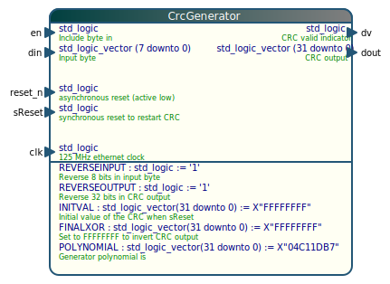

# entity-block

Converts a VHDL entity to a nice looking image in .svg format.

# build

Dependencies: Qt5. On a fresh Ubuntu install you can install the dependencies like this:
    sudo apt install build-essential qt5-default

    qmake entity-block.pro
    make

# Usage

    Usage: ./entity-block [options] input output
    Reads a vhdl file and outputs a .svg file with the entity block
    (All command line options will be stored)
    
    Options:
      -h, --help                        Displays this help.
      -v, --version                     Displays version information.
      -c, --comment-color <color>       Change default comment color to <color>
      -n, --port-name-color <color>     Change default port name color to <color>
      -t, --port-type-color <color>     Change default port type color to <color>
      -b, --background-color <color>    Change default background color to <color>
      -l, --header-left-color <color>   Change default left (gradient) in the
                                        header color to <color>
      -r, --header-right-color <color>  Change default right (gradient) in the
                                        header color to <color>
      -e, --entity-title-color <color>  Change default entity color to <color>
      -B, --border-color <color>        Change default border color to <color>
      -p, --port-color <color>          Change default port symbol color to <color>
      -R, --corner-radius <number>      Change default corner radius to <number>
      -s, --shadow-color <color>        Change default shadow color to <color>
      -w, --line-weight <number>        Change default line thickness to <number>
    
    Arguments:
      input                             VHDL file to convert
      output                            SVG file to output
    
The shadow (or any other object) can be removed completely by setting the alpha value to 0
    ./entity-block CrcGenerator.vhd -s "#00FFFFFF"

# Example

This entity:

    entity CrcGenerator is
      generic (
        REVERSEINPUT  : std_logic                     := '1'; --Reverse 8 bits in input byte
        REVERSEOUTPUT : std_logic                     := '1'; --Reverse 32 bits in CRC output
        INITVAL       : std_logic_vector(31 downto 0) := X"FFFFFFFF"; --Initial value of the CRC when sReset 
        FINALXOR      : std_logic_vector(31 downto 0) := X"FFFFFFFF"; --Set to FFFFFFFF to invert CRC output
        -- Generator polynomial is
        POLYNOMIAL    : std_logic_vector(31 downto 0) := X"04C11DB7"
        );
      port (
        clk     : in  std_logic; -- 125 MHz ethernet clock
        reset_n : in  std_logic; -- asynchronous reset (active low)
        sReset  : in  std_logic; -- synchronous reset to restart CRC
        en      : in  std_logic; -- Include byte in 
        din     : in  std_logic_vector (7 downto 0); --Input byte
        dv      : out std_logic; -- CRC valid indicator
        dout    : out std_logic_vector (31 downto 0)  -- CRC output
        );
    end CrcGenerator;

converts into this:

# Known issues

* The application does not work without a graphical session (X-server etc).
    * To work around this issue, start entity block with the argument `-platform offscreen`
* The paint function is called twice for now, in order to determine the SVG size, then it is drawn again. 
    * This could be done a little neater but it works.
